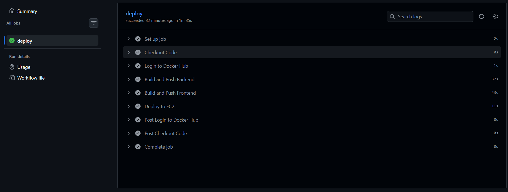
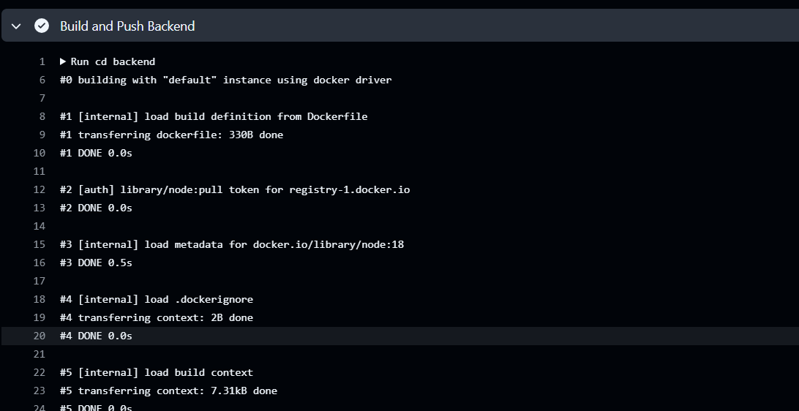
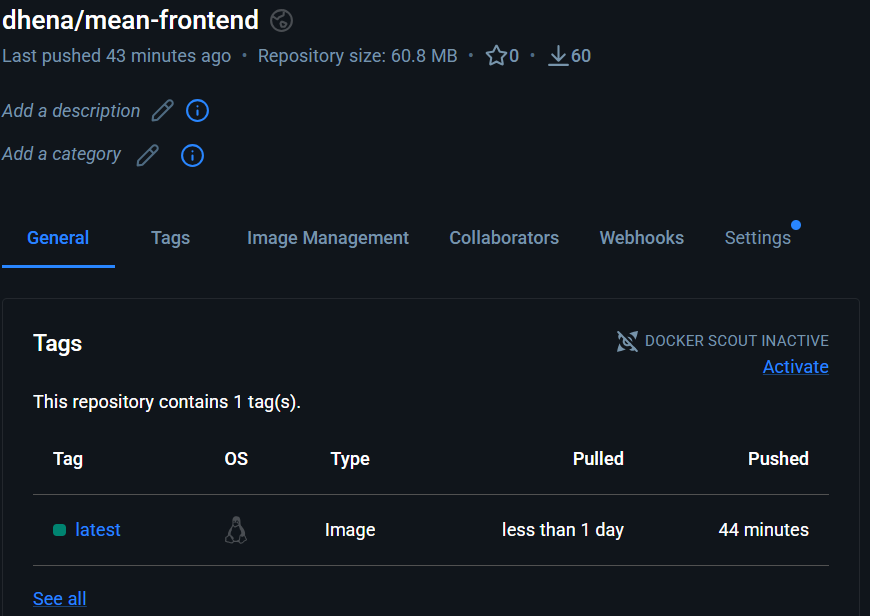
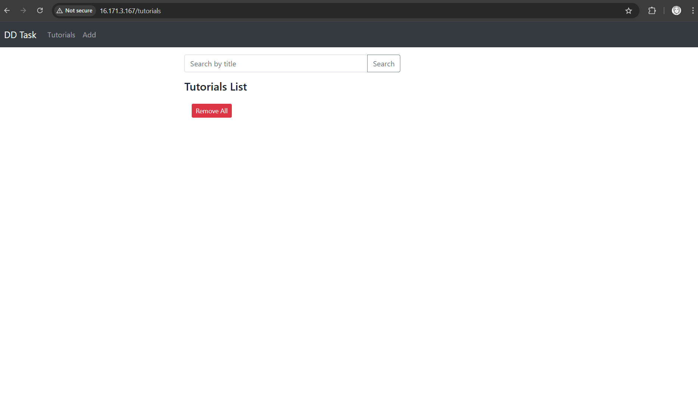

# MEAN Stack Application – Dockerized & CI/CD Deployed

This project demonstrates the containerization, deployment, and CI/CD automation of a full-stack MEAN application using Docker, AWS EC2, Nginx reverse proxy, and GitHub Actions.

## Architecture

Internet (Port 80)
        ↓
Nginx Reverse Proxy
        ↓
Frontend (Angular Container)
        ↓
Backend (Node.js Container)
        ↓
MongoDB (Docker Container)

## Docker Setup

- Backend container built using Node base image.
- Frontend uses multi-stage build and served via Nginx.
- MongoDB uses official MongoDB Docker image.
- All services orchestrated using docker-compose.

## Nginx Reverse Proxy

Nginx acts as a reverse proxy:

- Routes `/` to frontend container
- Routes `/api` to backend container
- Only port 80 is exposed publicly

nginx.conf

## CI/CD Pipeline (GitHub Actions)

On every push to main branch:

1. Build backend Docker image
2. Push backend image to Docker Hub
3. Build frontend Docker image
4. Push frontend image
5. SSH into EC2
6. Pull latest images
7. Restart containers

.github/workflows/deploy.yml

Local Setup
git clone <repo>
cd project
docker-compose up --build

## AWS Deploment
1. Launched Ubuntu EC2
2. Installed Docker & Docker Compose
3. Clone repository
 docker-compose up -d

 ## CI/CD
 git push origin main

 ## Screenshots

### CI/CD Pipeline Execution

### Docker Hub Images

### Application Running

.png)

### Nginx Configuration
.png)

